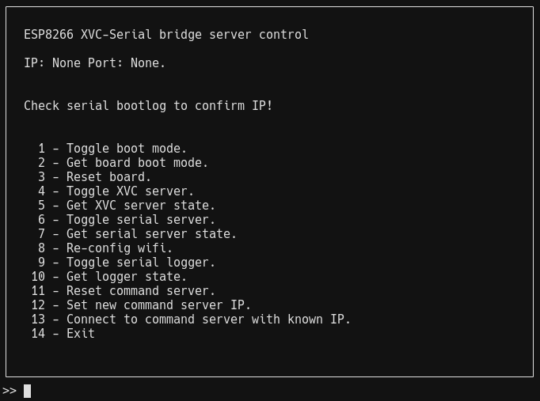

# ***ESP8266 based control unit, modded on EBAZ420X***

## Features
- Remotely hardware bootmode selection and reset
- Remote XVC and serial bridge:
    - ESP8266 XVC implementation from:
        - https://github.com/pftbest/xvc-esp8266.git

## Pinouts
***ALL PINOUT REFERENCES BASED ON NODEMCU ESP8266, ADAPT IF NEEDED***

### JTAG
- TMS = D2;
- TCK = D5;
- TDO = D6;
- TDI = D7;

### Serial
- Board's serial connected to ESP8266 serial port 0

### Misc
- D0 connect to MR pin of u65 through a 1k resistor, serve as board reset.
- D1 connect to R2584-U12-IO0 through a 1k resistor, serve as bootmode selector from ESP8266
- D4 has a 20k pullup, connected to a push switch (bootmode selector button) to GND

## Default ports
- Command port: 42069
- Serial passthrough: 2222
- XVC: 2542

## Notes
- Settings in arduino: 160Mhz, Vtable in heap || IRAM, V2 higher bandwidth
- Working unreliably in busy network, need to investigate, use hotspot or isolated network for now

